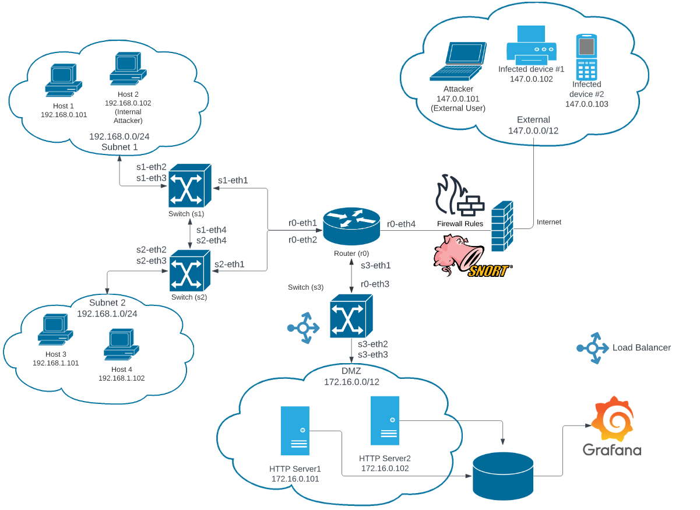

# SDS-Project-MCYBERS23'
## 1. Topology

## 2. Running ONLY the Mininet topology to first tests
First install the dependencies with:
```
pip3 install -r requirements.txt
```
First, we have to start the Ryu Manager (with a simple_switch_13.py to test):
```
sudo ryu-manager ~/ryu/ryu/app/simple_switch_13.py
```
After that you must run the topology with:
```
sudo mn -c && sudo python3 routerTopology.py
```
## 3. Mininet Topology + Snort (production scripts)
### 3.1. Snort preparation
```
sudo apt-get install snort
```
To add snort rules, open the file located in /etc/snort/rules named Myrules.rules. Inside this file, put the following line:
```
include $RULE_PATH/Myrules.rules
```
And comment this other one (one example could be the ICMP if another rule is set). Remember to comment all the lines that are related with the rules that you want to implement, to avoid the duplicate elements:
```
#$RULE_PATH/icmp-info.rules 
```
For setup the Snort, run the following commands (creating a new s4-snort interface). Run these commands:
```
sudo ip link del s4-snort && sudo ip link add name s4-snort type dummy && sudo ip link set s4-snort up && sudo ovs-vsctl add-port s4 s4-snort && sudo ovs-ofctl show s4
```
The simple_switch_snort.py is located in ~/ryu/ryu/app/. NOTE: change the line 72 by this one:
```
print('alertmsg: %s' % msg.alertmsg[0].decode())
```
### 3.2. Running Mininet + Snort
Then, to verify the snort behaviour, run in different terminals:
```
sudo python3 routerProject.py
```
```
sudo ryu-manager ~/ryu/ryu/app/simple_switch_snort.py
```
```
sudo ip link del s4-snort && sudo ip link add name s4-snort type dummy && sudo ip link set s4-snort up && sudo ovs-vsctl add-port s4 s4-snort && sudo ovs-ofctl show s4
```
```
sudo snort -i s4-snort -A unsock -l /tmp -c /etc/snort/snort.conf
```
The previous commands allow to run the Mininet + Snort + LoadBalancer.
This command HAS to be performed to stop executing Mininet and Snort:
```
sudo kill -9 $(ps aux | grep 'snort' | awk '{print $2}') && sudo systemctl restart snort.service
```
When you stop the Mininet, always RUN to clear the cache:
```
sudo mn -c
```
NOTE: the following commands are the routes to the SNORT files (ignore them):
```
sudo cp ../snort/conf /etc/snort/ && \
sudo chown snort:snort /etc/snort/.conf && \
sudo cp ../snort/*rules /etc/snort/rules/
```
## 3. Load Balancer: how does it work?
Pending Adrian explanation...

## 4. Grafana part: procedure and commands

